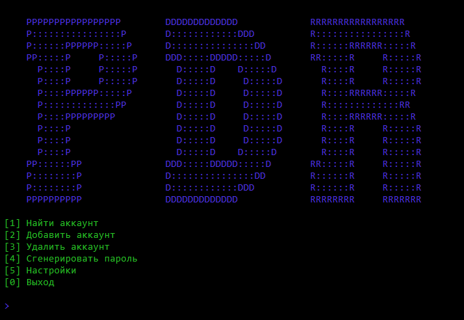



# PassDEFENDER (PDR)



## Описание
PassDEFENDER — OpenSource-разработка, позволяющая надёжно защитить пароли пользователя. Открытый код обеспечивает прозрачность работы приложения и возможность её доработки, а 1024-битовый ключ, генерирующий защиту, гарантирует надёжную защищённость данных.
PDR также включает в себя:

* поддержку русского и английского языка
* возможность настройки функционала приложения
* логирования запуска программы

Помимо защиты данных, PassDEFENDER позволяет настроить количество попыток входа для пользователя. Если они будут превышены, PDR сохраняет фото злоумышленника и переходит в спящий режим, в течение которого он будет недоступен.

## Установка и запуск
### Установка на Windows
Скачать с [репозитория](https://github.com/Azat-Bilalov/passdefender) zip-архив и распаковать в нужную папку. С [официально сайта](https://python.org/downloads) установить компилятор языка python. После в командной строке прописать:
``` cmd
cd [путь к папке/репозиторию]
pip install -r requirements.txt
python passdefender.py
```
Начальный пароль: `1234`

### Установка на Linux
В терминале выполнить команды:
``` bash
sudo apt install git
git clone https://github.com/Azat-Bilalov/BullsAndCows
sudo apt install python
pip install -r requirements.txt
python passdefender.py
```
Начальный пароль: `1234`

## Будующее проекта
В планах на основе данного приложения создать более функциональный проект, который обеспечил бы большую защиту данных и привлекательность приложения с помощью:

* передовых методов шифрования
* связки с telegram-ботом
* оконного мультиплатформенного дизайна
* использования дополнительных языков программирования

## Автор
__Билалов А. К.__
*Подготовлен для учатия в конкурсе КРИД2021*